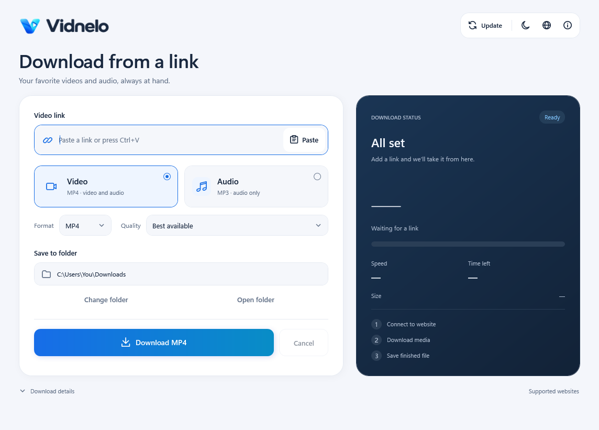
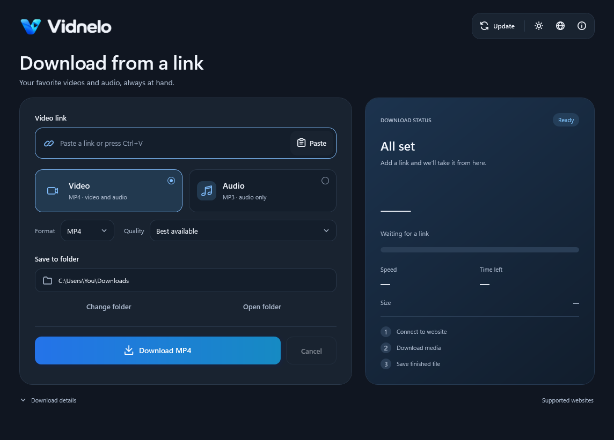

<p align="center">
  
</p>
<h1 align="center">Vidnelo</h1>
<p align="center">Video and audio downloads. A simple Windows interface, powered by yt-dlp.</p>
<p align="center">
  <a href="https://github.com/cavxvac/Vidnelo/releases/latest"><strong>Download for Windows</strong></a>
  · <a href="#getting-started">Getting started</a>
  · <a href="LICENSE">MIT License</a>
</p>



## Features

- Download a single video or extract its audio.
- Video formats: MP4, MKV, and WebM. Audio formats: MP3, M4A, Opus, WAV, and FLAC.
- Choose the best available quality or a resolution limit; select an MP3 bitrate.
- Light and dark themes, animated progress, and download details.
- 15 interface languages, including English, Polish, and Ukrainian.
- Searchable supported-site list provided by yt-dlp.
- Optional app update checks and a separate yt-dlp updater.

<details>
<summary>See dark mode</summary>



</details>

## Getting started

1. Download `Vidnelo-1.0-Windows-x64.zip` from [Releases](https://github.com/cavxvac/Vidnelo/releases/latest).
2. Extract the entire ZIP to a writable folder.
3. Run **Start Vidnelo.cmd**. First-time setup downloads yt-dlp, FFmpeg, FFprobe, and Deno from their official GitHub repositories.
4. When Vidnelo opens, paste a link, choose a format and quality, select a destination folder, and start downloading.

**Requirements:** Windows 10/11 x64, .NET Framework 4.8, and an internet connection. Allow approximately 1 GB for tools and setup archives, plus storage for your downloads.

After setup, you can run **Vidnelo.exe** directly. Keep the `tools/` folder alongside it. The globe button changes the interface language. Additional instructions in Polish are available in `INSTRUKCJA.txt`.

## Project layout

- `Vidnelo.exe` — the compiled application; distributed separately from the source code.
- `tools/` — yt-dlp, FFmpeg, FFprobe, and Deno, with source and license information.
- `assets/` — icons, original logo artwork, and artwork descriptions. The desktop shortcut uses an icon from this folder.
- `src/` — application code, WPF interface, and translations.
- `tests/` — checks and small local media fixtures.
- `scripts/` — tools for dependency setup, icon preparation, and desktop shortcut creation.
- `docs/` — interface verification report.

## Building

From the source folder, run these commands in PowerShell. Building requires Windows and the .NET Framework compiler.

```powershell
./build.ps1
./scripts/setup-tools.ps1
./Vidnelo.exe
```

The resulting executable is placed alongside `tools/`. Close Vidnelo before replacing its executable, or build a separate copy with:

```powershell
./build.ps1 -OutputName Vidnelo.dev.exe
```

Intermediate build files are stored in `.build/` and can be removed after compilation.

## Verification

- `python tests/check-translations.py` checks the translation catalog.
- `Vidnelo.exe --render-preview test-artifacts/ui` checks the interface and saves previews.
- `Vidnelo.exe --localization-preview test-artifacts/languages` checks localized layouts.
- `python tests/test-server.py` serves local test media at `127.0.0.1:18769`. With the server running, use `Vidnelo.exe --ui-test test-artifacts/flow` to check the download flow.

Compile the download engine checks in `tests/` together with `src/DownloadEngine.cs` using the .NET Framework `csc.exe` compiler. The progress model checks use `src/ProgressModel.cs`. Place engine test executables in the application folder so they can locate `tools/`.

Update checks use `src/AppUpdates.cs`, `src/Localization.cs`, the embedded translation catalog, and the WPF, System.Xaml, and System.Web.Extensions references.

Tests use local media fixtures and the `test-artifacts/` directory. Generated `.build/`, `.downloads/`, and `test-artifacts/` folders, along with temporary test executables, can be removed after testing.

User settings are stored separately in `%LOCALAPPDATA%/LinkDownloader`.

## Updates

Releases are published on [GitHub Releases](https://github.com/cavxvac/Vidnelo/releases).

Vidnelo checks for the latest stable release in the background at startup. When a newer version is available, it highlights the update button without interrupting downloads. The Updates window displays release notes and lets users open the release page, postpone the update, or skip that version. Manual checks also show skipped versions.

Connection failures at startup are silent. Manual checks display a message if the update check fails.

Application updates currently require manual installation: download the new version, close Vidnelo, and replace the application executable. User settings remain in `%LOCALAPPDATA%/LinkDownloader`. A separate **Update yt-dlp** button updates the download engine.

### Publishing a release

Use version tags such as `v1.0`, `v1.1`, or `v1.2.1`. The version in `src/AssemblyInfo.cs` must match the release tag. Attach the compiled application or distribution package to the release; GitHub's automatically generated source archives are not ready-to-run packages.

Drafts and prereleases are excluded from update checks. Until the first release is published, the app displays **No published releases yet.**

## Credits

Created by [cavxvac](https://github.com/cavxvac) · [gerardbinder.com](https://gerardbinder.com)

Vidnelo is an independent graphical client for [yt-dlp](https://github.com/yt-dlp/yt-dlp). Downloads are handled locally by yt-dlp and its supporting tools. Dependencies are downloaded during setup and are not included in the source repository or the small release ZIP. See [THIRD-PARTY-NOTICES.md](THIRD-PARTY-NOTICES.md) for project links and license information.

## License

Vidnelo is licensed under the [MIT License](LICENSE). Third-party tools retain their own licenses.
